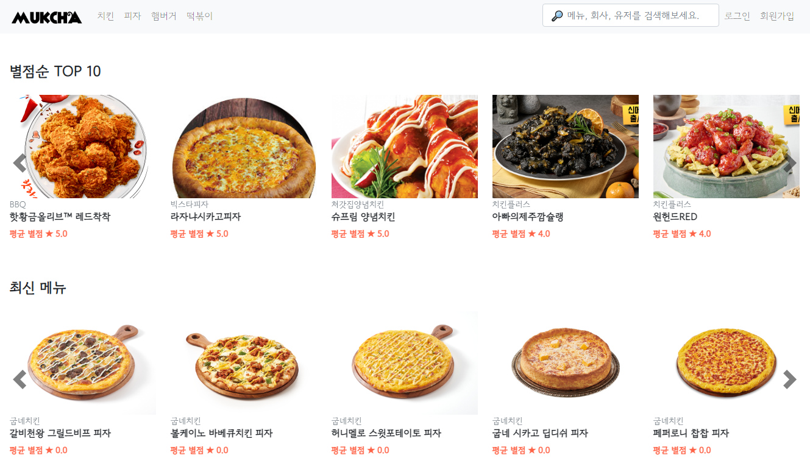

  <h3>안녕하세요! 👋</h3>

  

    개발자로써의 제2의 인생을 꿈꾸며 준비하는 신입🌱 개발자입니다.
  

  

    

      <h4>왜 개발자를?</h4>
    

    

      일단, 코딩 공부가 재밌었습니다.  
      학생 때부터 프로그래밍을 접했었더라면 참 좋았겠지만, 30대가 되서야 프로그래밍을 접하게 되었습니다.  
      코딩을 하며 기능을 구현하고 서비스하다보면 많은 문제들을 마주칩니다.  
      몇시간이 걸리든 포기하지 않고 고민하고 분석해서 문제를 해결하면, 그때 느끼는 쾌감은 받았던 스트레스의 배는 되는것 같습니다.  
      이 직업이라면 즐겁게 오래 일할 수 있을꺼라 생각하여 개발자로 전향하게 되었습니다.  
       
      저는 앞으로의 시대에서는 본인의 기술력이 있어야 살아남는 시대가 될것이라고 생각합니다.  
      저는 나이에 상관없이 변화를 두려워 하지않고 꾸준히 학습하여 본인의 스킬을 계속 향상시킬 수 있는 개발자가 되고 싶습니다.
    

  

   
  <h3>🛠 Tech Stack 🛠</h3>
  

    Back-End 개발자로서 성장하기 위하여 알고리즘 및 아래의 기술들을 활용하며 공부하고 있습니다.
  

  

    
    
    
    
    
     
    
    
    
    
    
    
     
    
    
    
  

  
 Tools 

  

    
    
  

  
 관심있거나 학습중인 기술들 

  

    
    
<!--      -->
  

  
   

  <h3>⌨ Main Project ⌨</h3>
  <h3><strong>먹챠(MUKCHA)</strong></h3>
  
프랜차이즈 메뉴 평가 및 기록 서비스

  
  
   
  
   
  <h3>📖 BLOG 📖</h3>
  

    개발 공부 정리를 올려두는 <a href="https://bluewind8791.github.io">기술 블로그</a>를 운영중입니다.
     
    시간 나는대로 내용을 더 다듬어서  로 글들을 이전하고 있습니다 😄
  

   
  <h3>Contact Me</h3>
  

    <!--    -->
    
    
  

  <!--  -->

